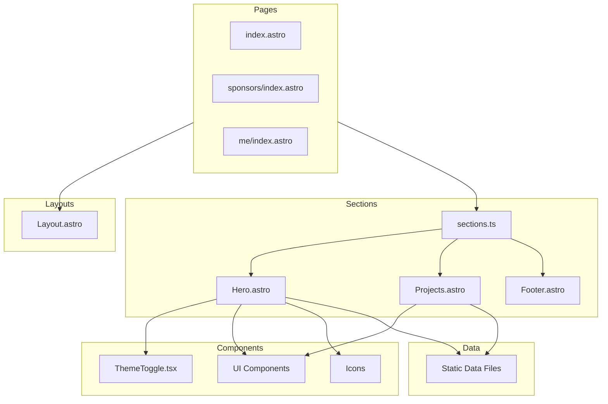

# Project Architecture

This document provides an overview of the project's architecture to facilitate understanding and future refactoring.

## Overview

This project is built using **Astro**, leveraging its component-based architecture and file-based routing. It incorporates **React** for interactive components (like the Theme Toggle) and uses **Tailwind CSS** along with custom CSS for styling.

## Directory Structure

The `src` directory is organized as follows:

- **`pages/`**: Defines the application's routes.
  - `index.astro`: The main landing page.
  - `404.astro`: Custom 404 error page.
  - Subdirectories (`blog`, `me`, `new`, `sponsors`) represent nested routes.
- **`layouts/`**: Contains the base HTML wrappers.
  - `Layout.astro`: The main layout used by pages, handling global styles, metadata, and theme initialization.
- **`sections/`**: Modular parts of a page.
  - `home/`: Sections specific to the home page (Hero, Projects, etc.).
  - `shared/`: Sections shared across multiple pages (Footer).
  - `sections.ts`: A barrel file that exports all sections for cleaner imports.
- **`components/`**: Reusable UI elements.
  - `ui/`: Generic UI components (buttons, effects, grids), aggregated in `ui.ts`.
  - `icons/`: SVG icons.
  - `ThemeToggle.tsx`: A React component for handling theme switching.
- **`data/`**: Static data files (TypeScript) used to populate components and sections.
- **`styles/`**: Global stylesheets (`global.css`).
- **`assets/`**: Static assets like images and SVGs.

## Component Hierarchy

The application follows a hierarchical structure:

1.  **Pages** compose the view using **Layouts** and **Sections**.
2.  **Sections** are high-level blocks that structure the content of a page. They consume **Components** and **Data**.
3.  **Components** are granular UI elements (buttons, inputs, icons) used within sections.

## Architecture Diagram

## Key Patterns

- **Barrel Files**: `src/sections/sections.ts` and `src/components/ui/ui.ts` are used to aggregate exports, allowing for cleaner import statements in consumers (e.g., `import { Hero } from '@/sections/sections'`).
- **Separation of Concerns**:
  - **Pages** handle routing and composition.
  - **Sections** handle specific content blocks.
  - **Components** handle reusable UI logic and styling.
  - **Data** is separated from presentation logic.
- **Hybrid Rendering**: The project uses Astro components for static content and React components (`client:idle`) for interactivity where needed.

## Future Refactoring Recommendations

- **Maintain Barrel Pattern**: Continue using `sections.ts` and `ui.ts` as new sections and components are added.
- **Component Reusability**: Identify common patterns in new sections and extract them into `src/components/ui`.
- **Data Driven**: Keep content in `src/data` to make it easier to update without touching the UI code.
